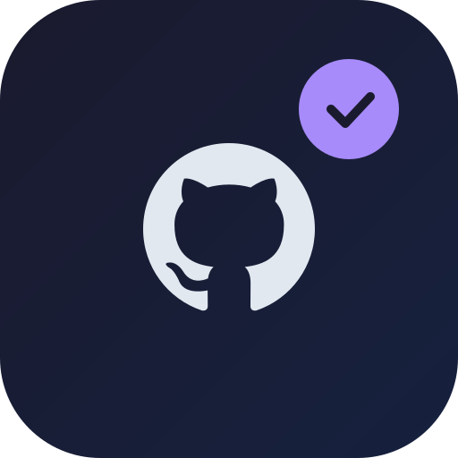

<p align="center">
    
</p>

<h1 align="center">GitHub Sentinel</h1>

<h4 align="center">
    Unified GitHub triage in your menu bar. Built as a Raycast extension.
</h4>

<p align="center">
  <a href="https://github.com/francis/gh-sentinel/blob/main/LICENSE"></a>
  
  
</p>

<p align="center">
  <a href="#whats-sentinel">What's Sentinel?</a> •
  <a href="#features">Features</a> •
  <a href="#usage">Usage</a> •
  <a href="#architecture">Architecture</a> •
  <a href="#license">License</a>
</p>

> [!IMPORTANT]
> Sentinel uses the `gh` CLI for all GitHub API calls — no OAuth tokens needed. Make sure `gh` is installed and authenticated.

## What's Sentinel?

GitHub Sentinel is a Raycast menu bar extension that consolidates your GitHub notifications, pull requests, and issues into a single, priority-scored triage list. Instead of juggling multiple tabs and notification streams, Sentinel surfaces what matters most with smart priority scoring and repo-level organization.

## Features

- **Unified triage** — PRs, issues, and notifications from three GitHub data sources merged into one list
- **Priority scoring** — Items ranked by reason: review requested (100), assigned (70), mentioned (50), CI failing (30), and more
- **Repo grouping** — Items grouped by repository with pin/hide controls for custom ordering
- **PR review in terminal** — Hold ⌥ on any PR to open a tmux window with `opencode pr` in a dedicated worktree
- **Native notifications** — Per-repo macOS notifications via `terminal-notifier` with deduplication
- **Configurable repos** — Watch specific repos and toggle notification preferences per repo
- **GitHub-style icons** — PR and issue state icons matching Raycast's GitHub extension aesthetic

## Usage

Install dependencies and start development:

```sh
bun install
just dev
```

> [!TIP]
> See the [Justfile](./Justfile) for all available commands: `just b` (build), `just d` (dev), `just l` (lint), `just t` (typecheck), `just f` (fix).

### Commands

| Command | Mode | Description |
|---------|------|-------------|
| **Sentinel** | Menu Bar (1m interval) | Triage menu bar icon with count, grouped items, pin/hide |
| **Configure Watched Repos** | View | Select repos to watch and configure per-repo notifications |

### Menu Bar Actions

| Action | Trigger | Description |
|--------|---------|-------------|
| Open in browser | Click item | Opens PR/issue on GitHub |
| Review in opencode | ⌥ + Click PR | Opens tmux window with `opencode pr` in a worktree |
| Pin/Unpin repo | Click action | Pinned repos appear first with 📌 |
| Hide repo | Click action | Moves repo to collapsed "Hidden" section |
| Mark All as Read | Click action | Marks all GitHub notifications as read |

## Architecture

Sentinel refreshes on a 1-minute interval, pulling from three GitHub data sources:

1. **Notifications API** — `gh api /notifications` for subscribed activity
2. **Review Requests** — GraphQL search for `is:pr is:open review-requested:@me`
3. **Assignments** — GraphQL search for `is:open assignee:@me`

Items are deduplicated, enriched with PR metadata via batched GraphQL, scored by priority, and grouped by repository. A stale-while-revalidate cache renders the previous snapshot immediately while refreshing in the background.

The review action creates a git worktree at `~/src/<org>/<repo>/pr/<number>` and opens `opencode pr` in a new tmux window.

## License

This project is licensed under the MIT License - see the [LICENSE](LICENSE) file for details.
